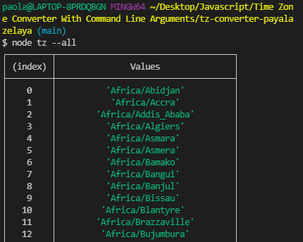

# Time Zone Converter

## How the Converter Works

The converter allows a user to find the timezones of various locations across the globe through arguments passed in the command line terminal. The program sets the timezone to be the default of "America/New_York." If an argument is passed, the user can find the timezone of any location but if no argument is passed, a usage message is printed in the console of the terminal.

## Instructions

In the terminal, use the command line to find a timezone that you want to see or find timezones from different areas of the globe. An example would be that if you are finding the time of Rome, you would write the argument in this format in the commmand line using the --format flag:

To get a list of all of the timezones, use the following argument in the command line using the --all flag:

To be specific with timezones of a particular country, use the following argument in the command line using the --country flag and the country's two-letter code:

